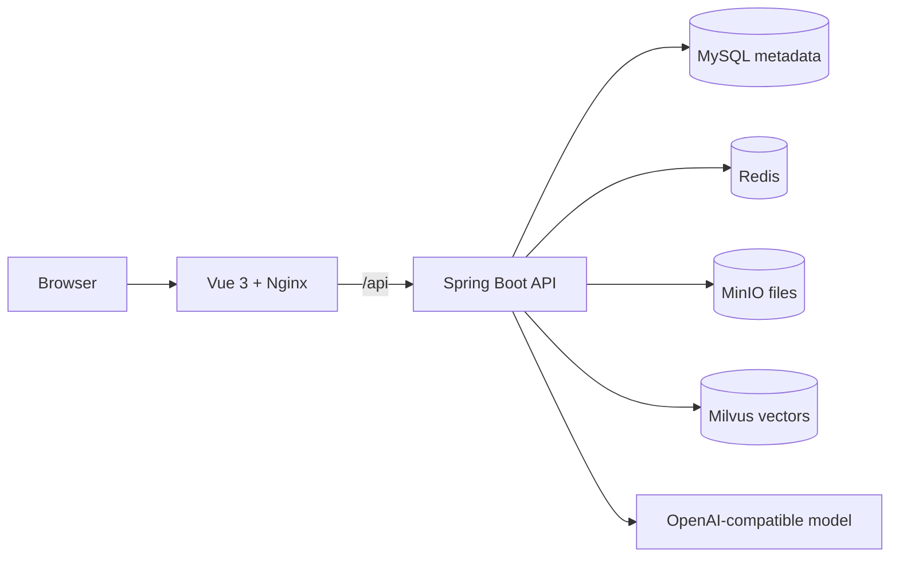

<p align="center">
  <a href="#readme">English</a>
</p>

<h1 align="center">CampusRAG-QA</h1>

<p align="center">
  <em>"Upload campus knowledge. Ask naturally. Get grounded answers."</em>
</p>

<p align="center">
  
  
  
  
  
</p>

<p align="center">
  A runnable campus knowledge assistant built with Spring Boot, LangChain4j, Milvus, MinIO, MySQL, Redis, and Vue.
</p>


## Why This Project

CampusRAG-QA is the clean baseline for the larger Campus QA family. It focuses on the essential RAG loop:

1. Upload a knowledge file.
2. Store file metadata and object content.
3. Create embeddings and save vectors.
4. Retrieve relevant context.
5. Ask the LLM for a grounded answer.

## Architecture



## Quick Start

```bash
cp .env.example .env
docker compose up -d --build
```

Open:

- Frontend: `http://localhost:3000`
- Backend health: `http://localhost:8080/actuator/health`
- MinIO console: `http://localhost:9001`

Set `OPENAI_API_KEY` in `.env` before expecting real model answers.

## Production-Oriented Defaults

- `frontend/index.html` is included so Vite and Docker builds run correctly.
- Nginx proxies `/api` to the backend in Docker.
- `.env.example` documents runtime configuration.
- Docker Compose includes service health checks for MySQL, Redis, and backend.
- Spring Boot exposes `health` and `info` actuator endpoints.
- Upload size is configured for 50 MB request/file limits.

## Repository Layout

```text
backend/              Spring Boot API and RAG services
frontend/             Vue 3 single page app
docs/assets/          README screenshots and visual assets
docs/OPERATIONS.md    Local runbook and troubleshooting notes
docker-compose.yml    Full local runtime stack
.env.example          Runtime configuration template
```

## Next Hardening Steps

- Replace whole-file embeddings with chunking and metadata-rich segments.
- Persist retrieved text alongside vector IDs.
- Add reranking and source citation rendering.
- Add authentication, tenant isolation, and audit logging.
- Add CI once backend dependency versions are pinned and compile-verified.
