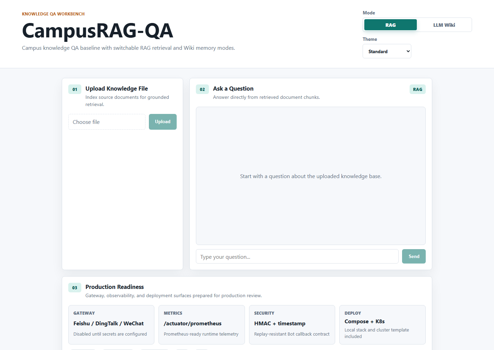
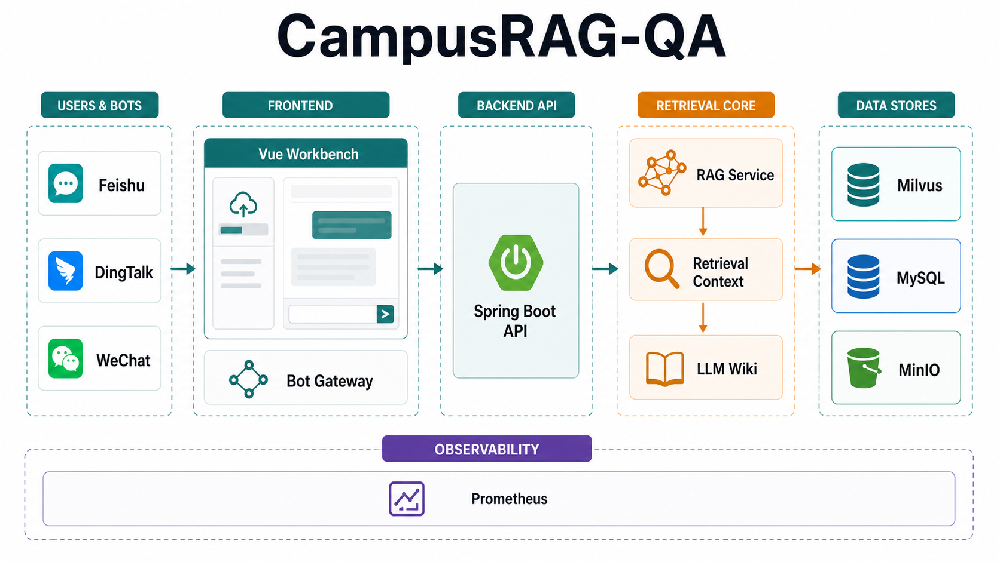
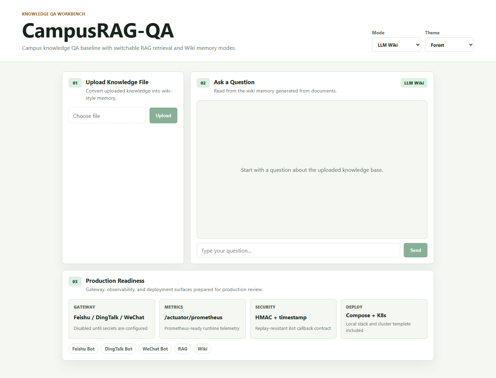
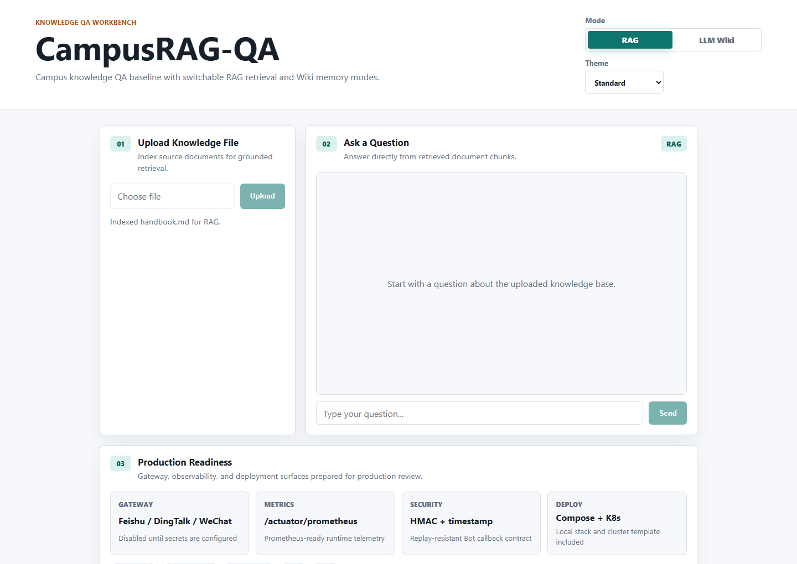
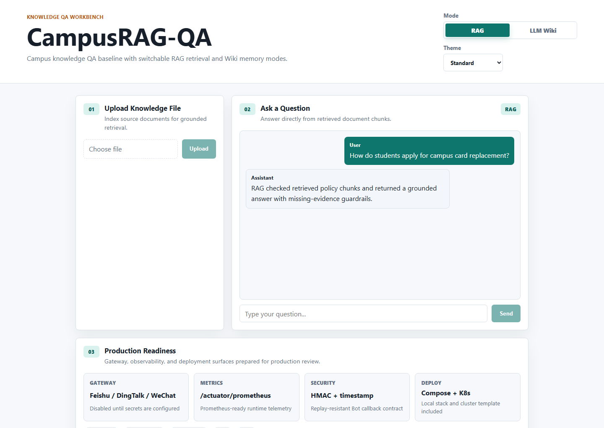
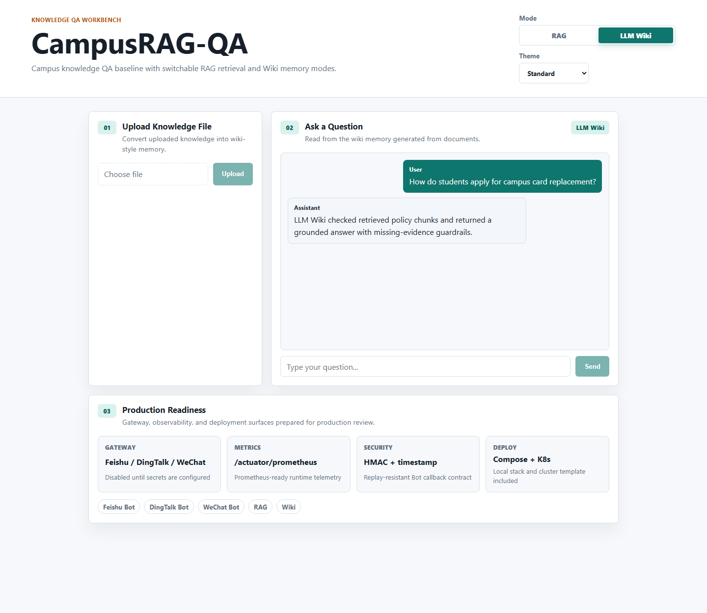
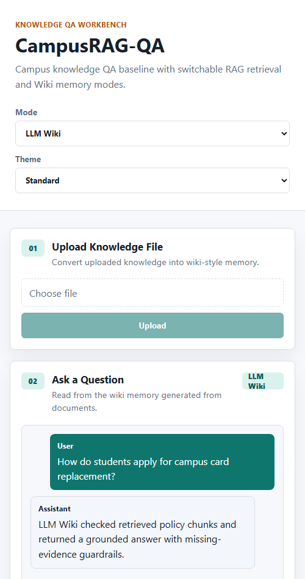
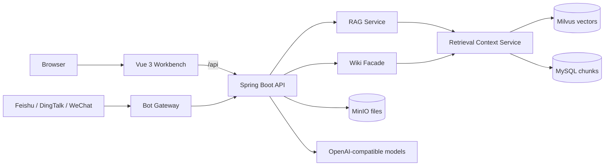

<h1 align="center">CampusRAG-QA</h1>

<p align="center">
  Campus knowledge QA baseline with switchable <strong>RAG</strong> and <strong>Wiki</strong> modes.
</p>

<p align="center">
  
  
  
  
  
</p>

<p align="center">
  <a href="#quick-start">Quick Start</a> |
  <a href="docs/OPERATIONS.md">Operations</a> |
  <a href="docs/PRODUCTION-ARCHITECTURE.md">Architecture</a> |
  <a href="docs/PRODUCTION-GAPS.md">Production Gaps</a> |
  <a href="docs/MAINTENANCE.md">Maintenance</a> |
  <a href="docs/BOT-INTEGRATION.md">Bot Integration</a> |
  <a href="docs/OPEN_SOURCE_REFERENCES.md">References</a>
</p>

<p align="center">
  
</p>

## Architecture Framework

<p align="center">
  
</p>

> This image is an ImageGen-rendered visual architecture map. The Mermaid diagram and OpenAPI docs remain the exact engineering contract.

## Position

CampusRAG-QA is the clean baseline in the Campus QA family. It keeps the product scope intentionally small: upload knowledge files, index text chunks, ask grounded questions, and switch to Wiki mode when the same retrieval core should be presented as wiki-style context.

| Repository | Role |
| --- | --- |
| `Harzva/CampusRAG-QA` | Baseline RAG + Wiki mode. |
| `Harzva/CampusAgent-QA` | Adds agent tools and GBrain skills. |
| `Harzva/HyperMemory` | Final memory-enhanced system. |

## What It Does

| Capability | Implementation |
| --- | --- |
| Document ingestion | Uploads files through Spring Boot and stores metadata/object content. |
| Chunk retrieval | Splits text, stores chunk rows, indexes vectors, and hydrates real source text before prompting. |
| RAG chat | `/api/chat` answers using retrieved chunks only. |
| Wiki mode | `/api/wiki/chat` formats retrieved chunks as wiki-style context. |
| Bot gateway | `/api/bot/{channel}/callback` routes normalized Feishu, DingTalk, and WeChat messages. |
| Frontend | Vue 3 workbench with mode switch, upload flow, and streaming-ready chat panel. |

## Visual Walkthrough

Six README-owned screenshots show the runnable workbench across modes, data flow, Bot readiness, and mobile layout.

| Dashboard | Wiki mode | Upload state |
| --- | --- | --- |
|  |  |  |

| Conversation | Production readiness | Mobile |
| --- | --- | --- |
|  |  |  |

## Architecture



## Quick Start

```bash
cp .env.example .env
docker compose up -d --build
```

Open:

- Frontend: `http://localhost:3000`
- Backend health: `http://localhost:8080/actuator/health`
- MinIO console: `http://localhost:9001`

Set `OPENAI_API_KEY` in `.env` before expecting model-backed answers.

## Local Development

```bash
cd frontend
npm install
npm run dev
```

```bash
cd backend
mvn spring-boot:run
```

## Repository Layout

```text
backend/              Spring Boot API, ingestion, retrieval, and Wiki mode
frontend/             Vue 3 workbench
docs/assets/          README screenshots
docs/OPERATIONS.md    Runtime and endpoint notes
docs/PRODUCTION-ARCHITECTURE.md
docs/PRODUCTION-GAPS.md
docs/MAINTENANCE.md
docs/BOT-INTEGRATION.md
docs/SCREENSHOTS.md
docs/openapi/          API contract templates
deploy/k8s/            Kubernetes deployment template
docs/PRODUCTION-REVIEW.md
SECURITY.md            Security policy and secret-handling notes
docker-compose.yml    Full local runtime stack
.env.example          Runtime configuration template
```

## Production Readiness

See [Production Review](docs/PRODUCTION-REVIEW.md) and [Production Gaps](docs/PRODUCTION-GAPS.md) for the detailed audit. The remaining production blockers are authentication, tenant-scoped data isolation, Bot idempotency, and structured citations.
